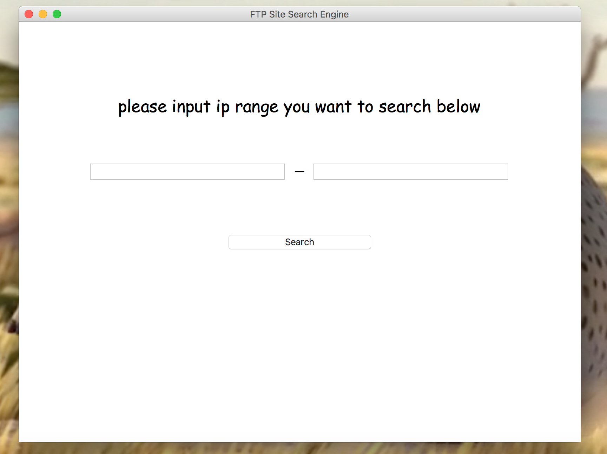
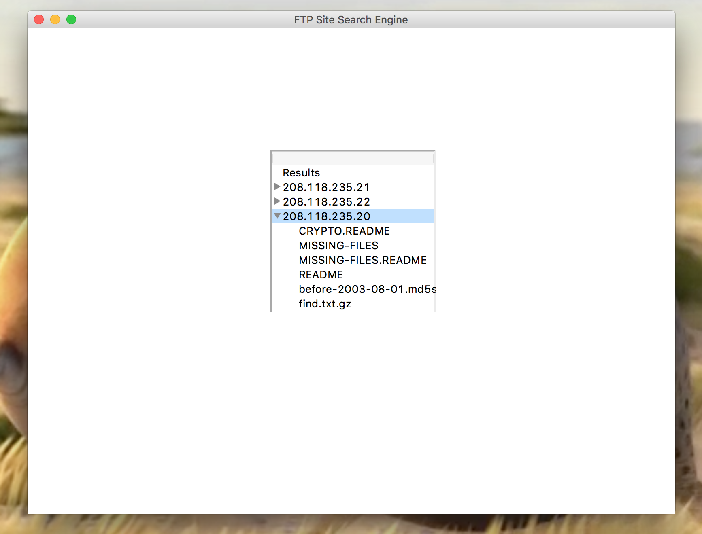

# # FTP Search Tool

A simple Python FTP search tool that allows users to search for anonymous FTP sites within a specified IP(s) list and filter results based on file type, name, date range, and size.

## Requirements

- Python 3.x

## Installation

1. Clone the repository or download the source code:

```sh
git clone https://github.com/philve/ftp-search-tool.git
cd ftp-search-tool
```

2. (Optional) Create and activate a virtual environment:

```sh
python3 -m venv venv
source venv/bin/activate
```

## Running the Application

To run the application, simply execute the `app.py` script:

```sh
python3 app.py
```

The application will open a window with a simple GUI. Enter the desired IP range, file type, name contains filter, date range, and size range for searching anonymous FTP sites and click the "Search" button. The results will be displayed in a list within the GUI.

## Usage

1. Enter the IP list (one IP per line) in the text box.
2. (Optional) Enter the file type to filter results (e.g., .txt).
3. (Optional) Enter a string that should be contained in the file name to filter results (e.g., report).
4. (Optional) Enter a date range in the format YYYY-MM-DD - YYYY-MM-DD to filter results.
5. (Optional) Enter a size range (Min - Max in bytes) to filter results.
6. Click the "Search" button to start the search.


## Author

Philve

## Many Thanks to

Sam Yang




